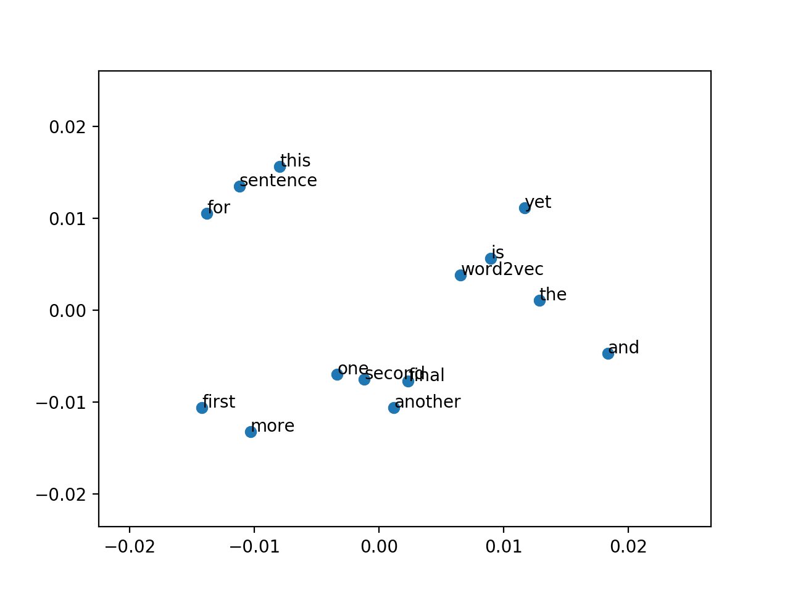

# Natrual Language Processing

AI-Specialization - UBA (Universidad de Buenos Aires) - Final Projects

## TP1: Text Vectorization and Naïve Bayes Classification on the 20 Newsgroups Dataset
<!-- \ -->
Implement a Naïve Bayes classifier with text vectorization using the 20 newsgroups dataset. Explore cosine similarity between documents and optimize classification performance using various vectorizers and model parameters.\
Colab: [NLP-TP1](https://github.com/sevann-radhak/procesamiento_lenguaje_natural/blob/main/clase_1/ejercicios/NLP-TP1.ipynb)

## TP2: Custom Embeddings with Gensim
\
Analyzing and comparing word embeddings from fake and true news datasets using Word2Vec. The project explores how different contexts influence word associations in fake versus true news, with visualization and similarity analysis for deeper insights.\
Colab: [NLP-TP2](https://github.com/sevann-radhak/procesamiento_lenguaje_natural/blob/main/clase_2/ejercicios/NLP-TP2.ipynb)

## TP3-word: Word-based Language Model using Recurrent Neural Networks
<!-- \ -->
Explore text generation using a word-tokenized corpus from song lyrics. Implement and compare RNN architectures, including LSTM and GRU, to generate sequences through greedy search and beam search strategies. Monitor training with perplexity and optimize the model for better performance.\
Colab: [NLP-TP3 word](https://github.com/sevann-radhak/procesamiento_lenguaje_natural/blob/main/clase_3/ejercicios/NLP-TP3%20word.ipynb)

## TP3-char: Character-Level Language Model using Recurrent Neural Networks
<!-- \ -->
Explore the development of a character-level language model using recurrent neural networks (SimpleRNN). The project involves tokenizing text from literary works, training the model, and generating sequences with techniques like greedy search and beam search, guided by perplexity for model optimization. The implementation includes customized callbacks for early stopping based on perplexity, ensuring efficient and meaningful text generation.\
Colab: [NLP-TP3 char](https://github.com/sevann-radhak/procesamiento_lenguaje_natural/blob/main/clase_3/ejercicios/NLP-TP3%20char.ipynb)

## TP4: LSTM-based Conversational AI for QA Bot
\
Develop a QA Bot using LSTM to handle user queries based on the ConvAI2 dataset. The project involves preprocessing data, implementing a sequence-to-sequence model with FastText embeddings, and optimizing the bot's accuracy through hyperparameter tuning. Colab: conversational_ai_project.\
Colab: [NLP-TP4](https://github.com/sevann-radhak/procesamiento_lenguaje_natural/blob/main/clase_6/ejercicios/NLP-TP4.ipynb)

## TP5: Sentiment Analysis with BERT: Classifying Product Reviews into three and five categories
\
Utilize BERT to classify product reviews into negative, neutral, and positive sentiments. Includes model building, training, and evaluation with TensorFlow and Hugging Face Transformers. The project highlights performance visualization and key metrics for three sentiment classes. The same for five categories.\
Colab: [NLP-TP5](https://github.com/sevann-radhak/procesamiento_lenguaje_natural/blob/main/clase_7/ejercicios/NLP-TP5.ipynb)

# Thanks!
Feel free to contact me by mail sevann.radhak@gmail.com_ for any doubt.\

<!-- # Procesamiento del Lenguaje natural
Este repositorio contiene el material de clases (presentaciones, ejercicios y notebooks) para NLP (CEIA - FIUBA)

## Contenido

### [Clase 1](clase_1/README.md) 
* Introducción a NLP (Natural Language Processing)
* Vectorización de documentos

### [Clase 2](clase_2/README.md)
* Preprocesamiento de texto
* Librerías de preprocesamiento para NLP
* Information-retrieval bots

### [Clase 3](clase_3/README.md)
* Word embeddings, CBOW y SkipGRAM
* Representación de palabras

### [Clase 4](clase_4/README.md)
* Redes recurrentes (RNN)
* Problemas de secuencia
* Estimación de próxima palabra

### [Clase 5](clase_5/README.md)
* Redes LSTM
* Análisis de sentimiento (sentiment analysis)
    
### [Clase 6](clase_6/README.md)
* Modelos Seq2Seq
* Bots conversacionales y traductores

### [Clase 7](clase_7/README.md)
* Celdas con Attention
* Transformers
* BERT y ELMo
* Fine tuning

### [Clase 8](clase_8/README.md)
* Cierre del curso
* Deployment de servicio NLP
* Flask, APIs
* Docker y Tensorflow Serving (TFX)

# Profesores
:octocat: Dr. Rodrigo Cardenas Szigety (2022-actual)\
:octocat: Esp. Ing. Hernán Contigiani (2021-2022) -->
